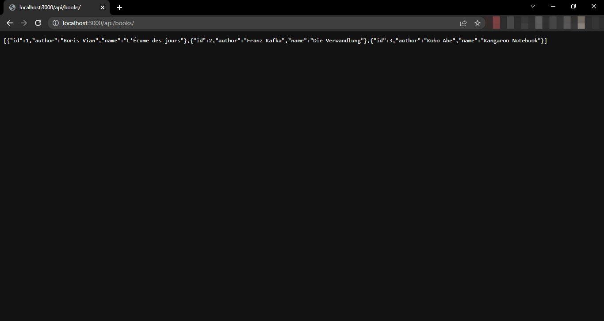
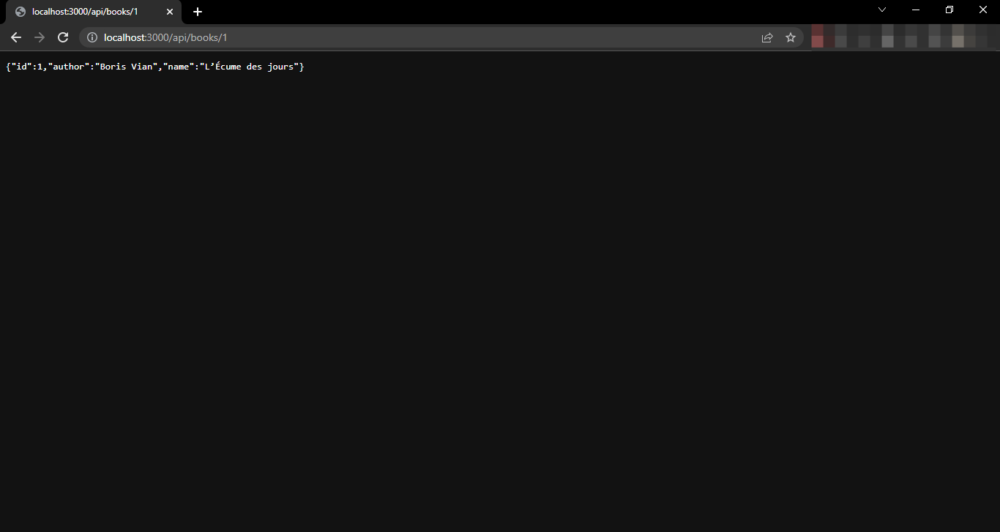
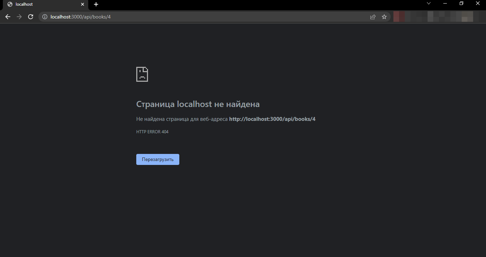
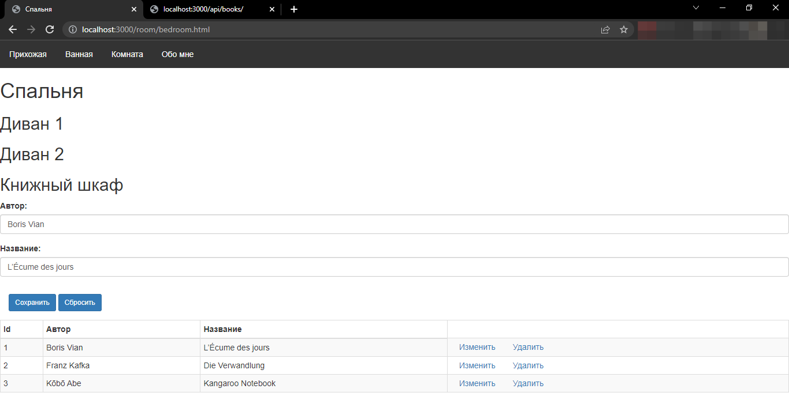
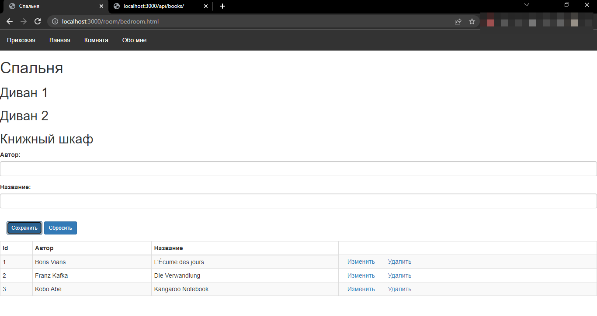

<h1>Node.js</h1>
<h2>Pet-проект на основе курса https://metanit.com/web/nodejs/</h2>
Имитация квартиры в виде сайта 
Используемые технологии: html, css, js (node.js (express, handlebars, fs))

<h3>API для взаимодействия с пользователем</h3>
<h4>--get-запрос--</h4>
Прямой get-запрос к серверу 
Get-запрос с id=1 к серверу 
Get-запрос с id=4 к серверу 
Get-запрос через форму 

<h4>--put-запрос--</h4>
Форма до изменений 
Форма после изменений 
