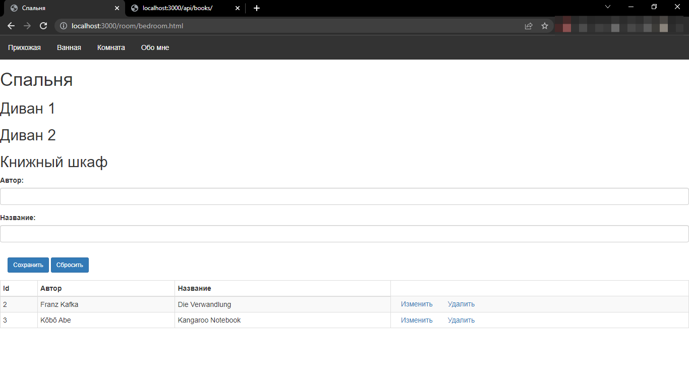
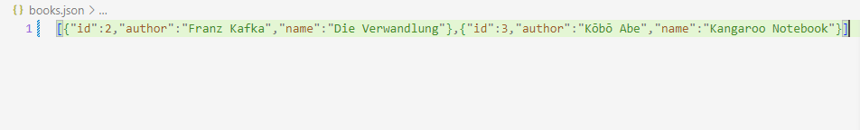
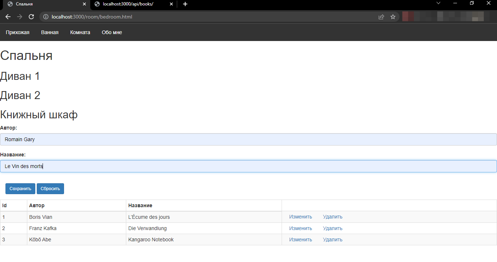
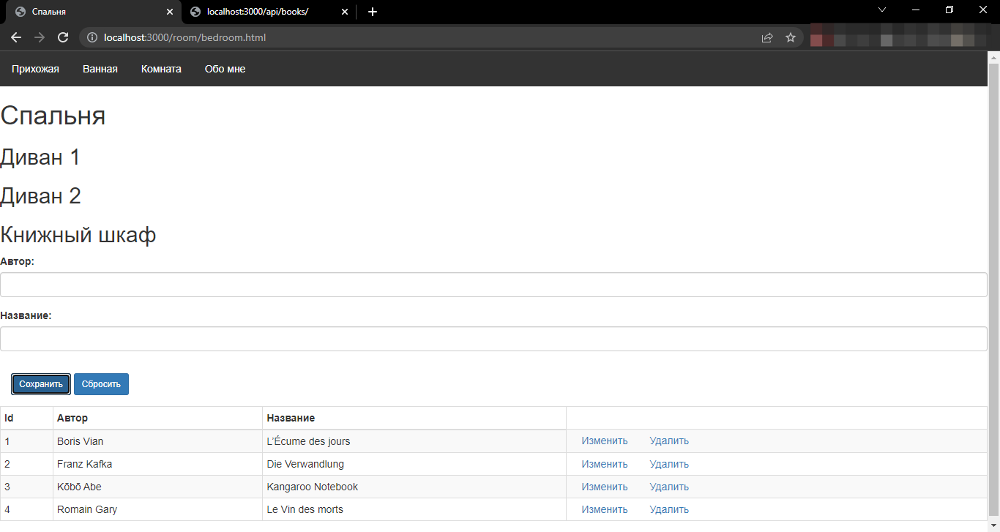
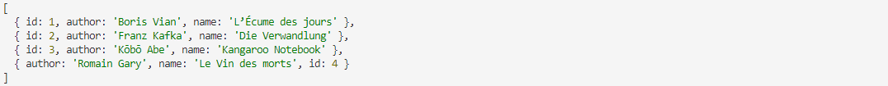
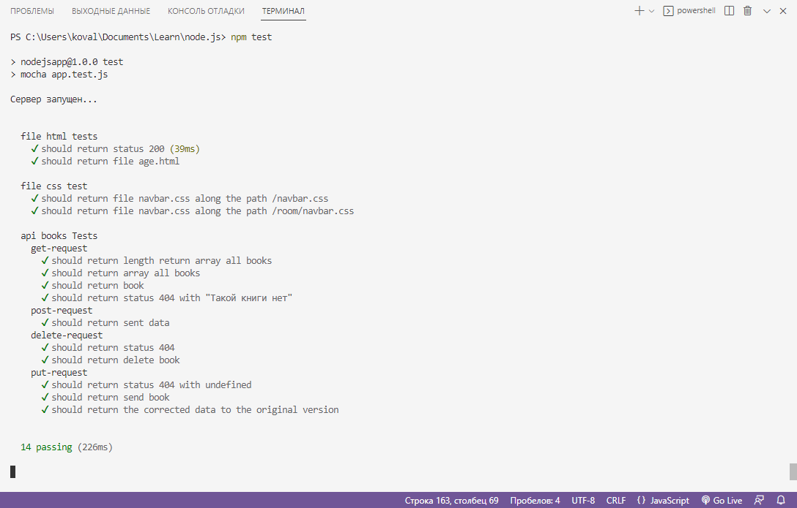

<h1>Node.js</h1>
<h2>Pet-проект на основе курса https://metanit.com/web/nodejs/</h2>
Имитация квартиры в виде сайта 
<a href="https://www.figma.com/proto/N88bYyWe5NhWS5Sx8kyxMh/Home?node-id=3%3A70&scaling=min-zoom&page-id=0%3A1&starting-point-node-id=1%3A2">Ссылка на макет в Figma</a> 
Используемые технологии: 
<ul>
<li>html,</li>
<li>css,</li>
<li>js 
<ul> <li>
node.js 
<ul>
<li>express,</li>
<li>handlebars,</li>
<li>fs,</li>
<li>тестирование: Mocha (supertest),</li>
<li>assert</li>
</ul>
</li>
</ul>
</li>
</ul>
<h2>Menu</h2>
<ul>
<li><a href="https://github.com/ValeriLursa/node.js/blob/master/README.md#api-%D0%B4%D0%BB%D1%8F-%D0%B2%D0%B7%D0%B0%D0%B8%D0%BC%D0%BE%D0%B4%D0%B5%D0%B9%D1%81%D1%82%D0%B2%D0%B8%D1%8F-%D1%81-%D0%BF%D0%BE%D0%BB%D1%8C%D0%B7%D0%BE%D0%B2%D0%B0%D1%82%D0%B5%D0%BB%D0%B5%D0%BC">Api для взаимодействия с пользователем</a></li>
<li><a href="https://github.com/ValeriLursa/node.js/blob/master/README.md#%D0%BC%D0%BE%D0%B4%D1%83%D0%BB%D1%8C%D0%BD%D0%BE%D0%B5-%D1%82%D0%B5%D1%81%D1%82%D0%B8%D1%80%D0%BE%D0%B2%D0%B0%D0%BD%D0%B8%D0%B5-%D1%81-%D0%BF%D0%BE%D0%BC%D0%BE%D1%89%D1%8C%D1%8E-mocha">Модульное тестирование</a></li>
</ul>

<h2>API для взаимодействия с пользователем</h2>
<h3 align="center">--get-запрос--</h3>
Прямой get-запрос к серверу 
Get-запрос с id=1 к серверу 
Get-запрос с id=4 к серверу 
Get-запрос через форму 

<h3 align="center">--put-запрос--</h3>
Форма до изменений 
Форма после изменений 

<h3 align="center">--delete-запрос--</h3>
Форма до удаления 
Форма после удаления 
Файл json после удаления 

<h3 align="center">--post-запрос--</h3>
Форма до добавления 
Форма после добавления 
Файл json в виде массива после добавления 

<a href="https://github.com/ValeriLursa/node.js/blob/master/README.md#">Назад</a>

<h2>Модульное тестирование с помощью Mocha</h2>
file html tests - тестирование возвращения файла с расширением html с сервера 
file css test - тестирование возвращения файла с расширением css с сервера 
api books Tests - тестирование api.books 

<a href="https://github.com/ValeriLursa/node.js/blob/master/README.md#">Назад</a>
